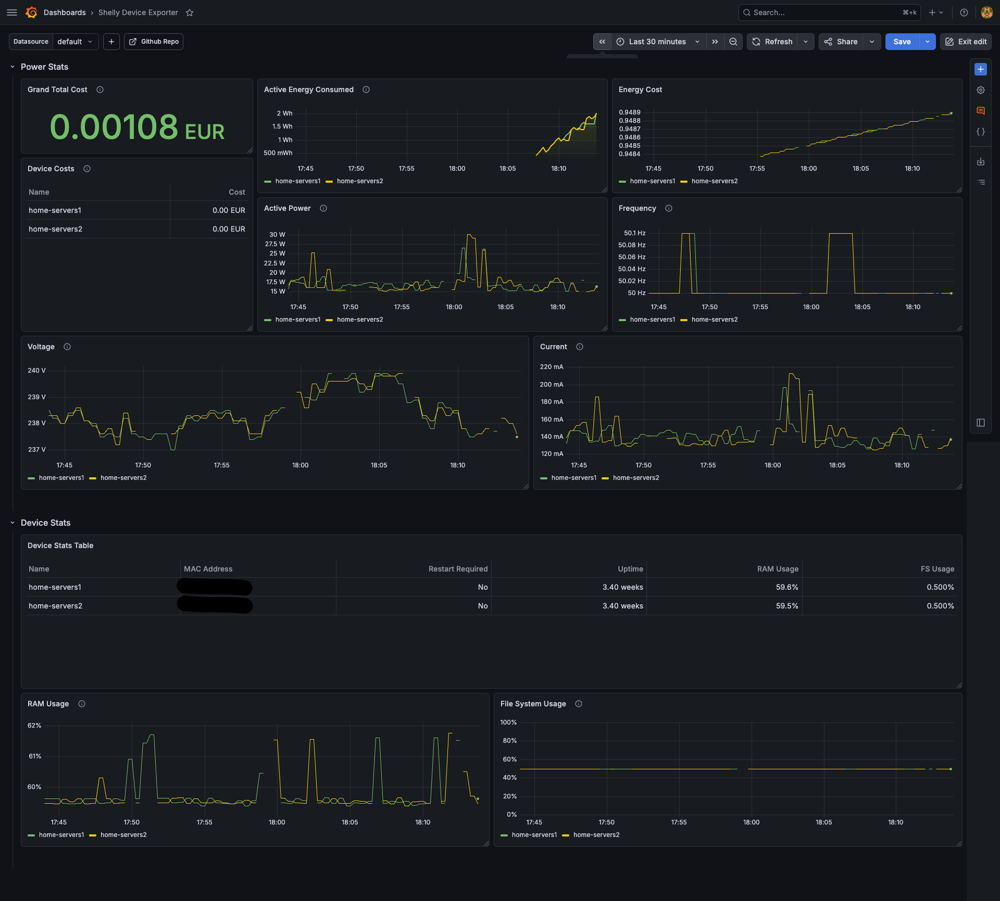

# Shelly Device Exporter

<p align="center">
  
  
  <br>
</p>
<p align="center">Prometheus exporter for Shelly Gen 2+ devices.</p>

<p align="center">
  <a href="https://github.com/veerendra2/shelly_device_exporter/actions"></a>
  <a href="https://goreportcard.com/report/github.com/veerendra2/shelly_device_exporter"></a>
  <a href="https://github.com/veerendra2/shelly_device_exporter/releases"></a>
  <a href="https://github.com/veerendra2/shelly_device_exporter/blob/main/LICENSE"></a>
  <a href="https://github.com/veerendra2/shelly_device_exporter/stargazers"></a>
  <a href="https://github.com/veerendra2/shelly_device_exporter/network/members"></a>
  <a href="https://ghcr.io/veerendra2/shelly_device_exporter"></a>
</p>

## Features

| Feature                 | Description                                                                                                |
| :---------------------- | :--------------------------------------------------------------------------------------------------------- |
| Concurrent Scraping     | Dynamically-sized worker pool to fetch statuses from multiple devices simultaneously.                      |
| Authentication          | Supports Shelly's required Digest Authentication out of the box.                                           |
| Energy Cost Calculation | Automatically calculates ongoing energy costs based on configurable `price_per_kwh` and `currency` fields. |

## Device Compatibility

_Compatible with all Gen 2+ devices utilizing the standard Shelly RPC API._

| Device                                                                                     | Tested |
| ------------------------------------------------------------------------------------------ | ------ |
| [Shelly Plug M Gen3](https://shelly-api-docs.shelly.cloud/gen2/Devices/Gen3/ShellyPlugMG3) | ✅     |

## Exported Metrics

_See list of [Metrics](https://github.com/veerendra2/shelly_device_exporter/wiki/Metrics)_

| Component                                                                        | Status |
| -------------------------------------------------------------------------------- | ------ |
| [Switch](https://shelly-api-docs.shelly.cloud/gen2/ComponentsAndServices/Switch) | ✅     |
| [System](https://shelly-api-docs.shelly.cloud/gen2/ComponentsAndServices/Sys)    | ✅     |

## Deployment

### Usage

```bash
Usage: shelly_device_exporter [flags]

Prometheus exporter for Shelly Gen 2+ devices.

Flags:
  -h, --help                        Show context-sensitive help.
      --address=":8080"             The address where the server should listen on ($ADDRESS).
      --config-file="config.yml"    Configuration file path ($CONFIG_FILE)
      --log-format="console"        Set the output format of the logs. Must be "console" or "json" ($LOG_FORMAT).
      --log-level=INFO              Set the log level. Must be "DEBUG", "INFO", "WARN" or "ERROR" ($LOG_LEVEL).
      --log-add-source              Whether to add source file and line number to log records ($LOG_ADD_SOURCE).
      --version                     Print version information and exit
```

### Configuration

The exporter requires a configuration file to know which devices to poll and how to connect to them.

```yaml
---
# (Optional) Used to calculate the 'shelly_device_energy_cost_total' metric.
# Both fields must be set to enable cost calculation.
price_per_kwh: 0.10
currency: "EUR"

# List of Shelly devices to monitor
devices:
  - name: "home-servers"
    address: "http://SHELLY_DEVICE_IP"
    username: "admin" # Optional, defaults to "admin"
    password: "YOUR_PASSWORD"
```

### Docker Compose

```yaml
services:
  shellydeviceexporter:
    image: ghcr.io/veerendra2/shelly_device_exporter:latest
    container_name: endoflife_exporter
    restart: unless-stopped
    environment:
      CONFIG_FILE: "/config.yml"
    volumes:
      - ./config.yml:/config.yml
    ports:
      - 8080:8080
```

### Prometheus Scrape Configuration

Add the following to your `prometheus.yml` scrape configurations to collect metrics from the exporter:

```yaml
scrape_configs:
  - job_name: "shelly_devices"
    # Adjust scrape interval based on your needs
    scrape_interval: 30s
    scrape_timeout: 15s
    static_configs:
      - targets: ["shellydeviceexporter:8080"] # Replace with the exporter's address
```

### Grafana Dashboard

- [Download Grafana Dashbaord Json](./assets/shelly-device-exporter-dashboard.json)



## Development

### Build & Test

- Using [Taskfile](https://taskfile.dev/)

_Install Taskfile: [Installation Guide](https://taskfile.dev/docs/installation)_

```bash
# Available tasks
task --list
task: Available tasks for this project:
* all:                   Run comprehensive checks: format, lint, security and test
* build:                 Build the application binary for the current platform
* build-docker:          Build Docker image
* build-platforms:       Build the application binaries for multiple platforms and architectures
* fmt:                   Formats all Go source files
* install:               Install required tools and dependencies
* lint:                  Run static analysis and code linting using golangci-lint
* run:                   Runs the main application
* security:              Run security vulnerability scan
* test:                  Runs all tests in the project      (aliases: tests)
* vet:                   Examines Go source code and reports suspicious constructs
```

- Build with [goreleaser](https://goreleaser.com/)

_Install GoReleaser: [Installation Guide](https://goreleaser.com/install/)_

```bash
# Build locally
goreleaser release --snapshot --clean
```

### Shelly API Reference

For debugging purposes, you can directly access your Shelly devices via curl:

```bash
# Get device info
curl 'http://YOUR_SHELLY_IP/shelly'

# Get device status using Digest Auth
curl --digest -u admin:"YOUR_PASSWORD" 'http://YOUR_SHELLY_IP/rpc/Shelly.GetStatus'
```
