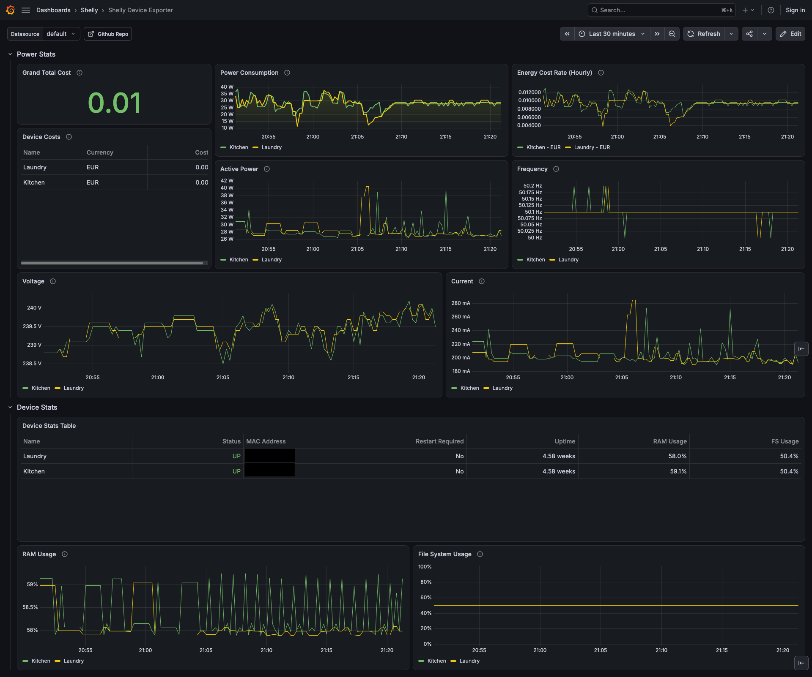

# Shelly Device Exporter

<p align="center">
  
  
  <br>
</p>
<p align="center">Prometheus exporter for Shelly Gen 2+ devices.</p>

<p align="center">
  <a href="https://github.com/veerendra2/shelly_device_exporter/actions"></a>
  <a href="https://github.com/veerendra2/shelly_device_exporter/releases"></a>
  <a href="https://github.com/veerendra2/shelly_device_exporter/blob/main/LICENSE"></a>
  <a href="https://github.com/veerendra2/shelly_device_exporter/stargazers"></a>
  <a href="https://github.com/veerendra2/shelly_device_exporter/network/members"></a>
  <a href="https://ghcr.io/veerendra2/shelly_device_exporter"></a>
</p>

## Features

| Feature                 | Description                                                                                                                                      |
| :---------------------- | :----------------------------------------------------------------------------------------------------------------------------------------------- |
| Multi-Target            | Follows the [multi-target exporter pattern](https://prometheus.io/docs/guides/multi-target-exporter/): devices are configured in prometheus.yml. |
| Authentication          | Supports Shelly's required Digest Authentication out of the box.                                                                                 |
| Energy Cost Calculation | Calculates ongoing energy costs based on configurable `price_per_kwh` and `currency` fields.                                                     |

## Device Compatibility

_Compatible with all Gen 2+ devices utilizing the standard Shelly RPC API._

| Device                                                                                     | Tested |
| ------------------------------------------------------------------------------------------ | ------ |
| [Shelly Plug M Gen3](https://shelly-api-docs.shelly.cloud/gen2/Devices/Gen3/ShellyPlugMG3) | ✅     |

## Exported Metrics

_See list of
[Metrics](https://github.com/veerendra2/shelly_device_exporter/wiki/Metrics)_

| Component                                                                        | Status |
| -------------------------------------------------------------------------------- | ------ |
| [Switch](https://shelly-api-docs.shelly.cloud/gen2/ComponentsAndServices/Switch) | ✅     |
| [System](https://shelly-api-docs.shelly.cloud/gen2/ComponentsAndServices/Sys)    | ✅     |

## Deployment

### Usage

```bash
Usage: shelly_device_exporter [flags]

Prometheus exporter for Shelly Gen 2+ devices.

Flags:
  -h, --help                        Show context-sensitive help.
      --address=":8080"             The address where the server should listen on ($ADDRESS).
      --config-file="config.yml"    Configuration file path ($CONFIG_FILE)
      --log-format="console"        Set the output format of the logs. Must be "console" or "json" ($LOG_FORMAT).
      --log-level=INFO              Set the log level. Must be "DEBUG", "INFO", "WARN" or "ERROR" ($LOG_LEVEL).
      --log-add-source              Whether to add source file and line number to log records ($LOG_ADD_SOURCE).
      --version                     Print version information and exit
```

### Configuration

The exporter config defines auth modules only. Devices live in `prometheus.yml`.

```yaml
# config.yml — exporter configuration
price_per_kwh: 0.32 # optional, enables cost metrics
currency: EUR # optional, label for cost metric
modules:
  # no module defined: /probe falls back to the built-in "default" (no auth)
  # auth:
  #   username: admin              # defaults to "admin"
  #   password: {{ env "SHELLY_PASSWORD" }} # or password_file: /etc/secrets/shelly.txt
```

Set `password` or `password_file`, never both.

#### Environment Variable Templating

The configuration file supports environment variable templating using the
`{{ env "VAR" }}` syntax.

```yaml
modules:
  auth:
    username: admin
    password: '{{ env "SHELLY_PASSWORD" }}'
```

### Docker Compose

```yaml
---
name: shelly-device-exporter
services:
  shelly-device-exporter:
    image: ghcr.io/veerendra2/shelly_device_exporter:latest
    container_name: shelly-device-exporter
    volumes:
      - ./config.yml:/config.yml
    environment:
      CONFIG_FILE: /config.yml
    restart: unless-stopped
    user: ${PUID}:${PGID}
    hostname: shelly-device-exporter
```

### Prometheus Scrape Configuration

The exporter exposes `/probe?target=&lt;device&gt;&amp;module=&lt;name&gt;`.
Prometheus relabeling passes each device as the `target`. The Grafana
dashboards key on a `name` label, which you set per device in
`static_configs` (Prometheus attaches it to every scraped metric):

```yaml
scrape_configs:
  - job_name: shelly
    metrics_path: /probe
    params:
      module: [default] # omit if your devices have no password
    static_configs:
      - targets: ["192.168.1.100", "192.168.1.101"]
      - targets: ["192.168.1.102"]
        labels: { module: auth, name: Laundry Plug } # targets needing credentials
    relabel_configs:
      - source_labels: [__address__]
        target_label: __param_target
      - source_labels: [module]
        target_label: __param_module
      - source_labels: [__param_target]
        target_label: instance
      - target_label: __address__
        replacement: shelly-device-exporter:8080 # host:port where the exporter runs
```

### Grafana Dashboard

| Dashboard                                                                                                                                                                                     |
| --------------------------------------------------------------------------------------------------------------------------------------------------------------------------------------------- |
| [Grafana Dashboard Json (Prometheus Datasource)](https://raw.githubusercontent.com/veerendra2/shelly_device_exporter/refs/heads/main/assets/shelly-device-exporter-prometheus.json)           |
| [Grafana Dashboard Json (Victoriametrics Datasource)](https://raw.githubusercontent.com/veerendra2/shelly_device_exporter/refs/heads/main/assets/shelly-device-exporter-victoriametrics.json) |



---

See the [Development guide](./development/README.md) for local testing with
docker compose.
